# Finding Donors using a traditional census data in ML

**Abstract**
Using an traditional census data in Machine Learning studies, here I have derived prediction models to find potential donors.
If the income is expected larger than 50K, we find the person as potential donors and put emphasis on the activity to ask for donations.

Here in this excersize, we derive 2 models both from AutoML and manually configures Hyperdrive models.

In the AutoML model, the data is ingested as it is.
On the otherhand, in the Hyperdrive models, the data is pre-processed with MinMaxScalers and One-Hot encoding for RandomCofrestClassifiers.

Here you can find AutoML could derive a better accuracy model as it searches a certain variety of models.

Both models are deployed in an ACI instance and available for inferencing via a REST call. You can find the example of those REST calls in the last part of this report together with a screencast in YouTube.
You see that the turn around time for the REST call is about 150 msec in this case.

- [Finding Donors using a traditional census data in ML](#finding-donors-using-a-traditional-census-data-in-ml)
  - [Outline of the work](#outline-of-the-work)
  - [Dataset](#dataset)
    - [Overview](#overview)
    - [Task](#task)
    - [Access](#access)
  - [Automated ML](#automated-ml)
    - [Results](#results)
    - [Improvements](#improvements)
  - [Hyperparameter Tuning](#hyperparameter-tuning)
    - [Results](#results-1)
  - [Model Deployment](#model-deployment)
    - [AutoML](#automl)
      - [REST call example](#rest-call-example)
    - [Hyper Drive](#hyper-drive)
      - [REST call example](#rest-call-example-1)
  - [Screen Recording](#screen-recording)
    - [Train AutoML and Hyperdrive models and deploy to each endpoints](#train-automl-and-hyperdrive-models-and-deploy-to-each-endpoints)
    - [Consume endpoints with VSCode REST plug-in](#consume-endpoints-with-vscode-rest-plug-in)
  - [Future Improvement](#future-improvement)

## Outline of the work

Following explains the overall workflo reported in this document.


## Dataset
### Overview

The modified census dataset consists of approximately 32,000 data points, with each datapoint having 13 features. This dataset is a modified version of the dataset published in the paper *"Scaling Up the Accuracy of Naive-Bayes Classifiers: a Decision-Tree Hybrid",* by Ron Kohavi. You may find this paper [online](https://www.aaai.org/Papers/KDD/1996/KDD96-033.pdf), with the original dataset hosted on [UCI](https://archive.ics.uci.edu/ml/datasets/Census+Income).

This dataset is loaded to Azure Machine Learning Studio via GUI.

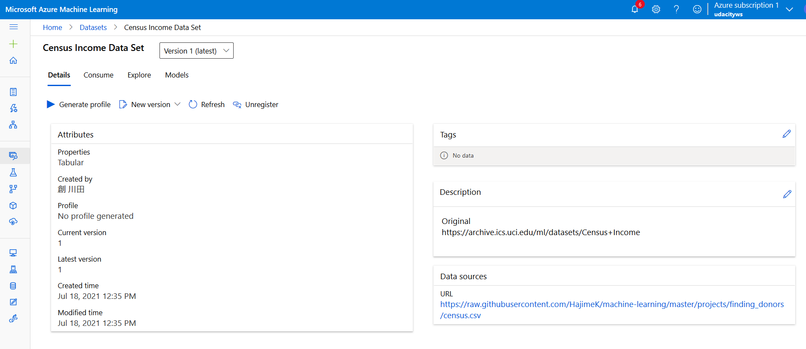

The data can be consumed in the python code with the following code snippet. Here *subscription_id*, *resource_group*, and *workspace_name* are masked, and need to set proper value when actually loading data.

```
# azureml-core of version 1.0.72 or higher is required
# azureml-dataprep[pandas] of version 1.1.34 or higher is required
from azureml.core import Workspace, Dataset

subscription_id = <subscription id>
resource_group = <resouce group name>
workspace_name = <ML Workspace name>

workspace = Workspace(subscription_id, resource_group, workspace_name)

dataset = Dataset.get_by_name(workspace, name='Census Income Data Set')
dataset.to_pandas_dataframe()
```

Or you can directly load from the source with the following code snippet.
```
datastore_path = "https://raw.githubusercontent.com/HajimeK/machine-learning/master/projects/finding_donors/census.csv"
ds = TabularDatasetFactory.from_delimited_files(path=datastore_path)
print(ds.to_pandas_dataframe())
```

**Features**
- `age`: Age
- `workclass`: Working Class (Private, Self-emp-not-inc, Self-emp-inc, Federal-gov, Local-gov, State-gov, Without-pay, Never-worked)
- `education_level`: Level of Education (Bachelors, Some-college, 11th, HS-grad, Prof-school, Assoc-acdm, Assoc-voc, 9th, 7th-8th, 12th, Masters, 1st-4th, 10th, Doctorate, 5th-6th, Preschool)
- `education-num`: Number of educational years completed
- `marital-status`: Marital status (Married-civ-spouse, Divorced, Never-married, Separated, Widowed, Married-spouse-absent, Married-AF-spouse)
- `occupation`: Work Occupation (Tech-support, Craft-repair, Other-service, Sales, Exec-managerial, Prof-specialty, Handlers-cleaners, Machine-op-inspct, Adm-clerical, Farming-fishing, Transport-moving, Priv-house-serv, Protective-serv, Armed-Forces)
- `relationship`: Relationship Status (Wife, Own-child, Husband, Not-in-family, Other-relative, Unmarried)
- `race`: Race (White, Asian-Pac-Islander, Amer-Indian-Eskimo, Other, Black)
- `sex`: Sex (Female, Male)
- `capital-gain`: Monetary Capital Gains
- `capital-loss`: Monetary Capital Losses
- `hours-per-week`: Average Hours Per Week Worked
- `native-country`: Native Country (United-States, Cambodia, England, Puerto-Rico, Canada, Germany, Outlying-US(Guam-USVI-etc), India, Japan, Greece, South, China, Cuba, Iran, Honduras, Philippines, Italy, Poland, Jamaica, Vietnam, Mexico, Portugal, Ireland, France, Dominican-Republic, Laos, Ecuador, Taiwan, Haiti, Columbia, Hungary, Guatemala, Nicaragua, Scotland, Thailand, Yugoslavia, El-Salvador, Trinadad&Tobago, Peru, Hong, Holand-Netherlands)

### Task

We have the following target variables

- `income`: Income Class (<=50K, >50K) 
- In the Hypderdriver case, the above Income Class corresponds to (0, 1) in the prediction outputs.

Out of the 13 features, predict the target variable, which is one of (<=50K, >50K) in AutoML, and (0,1) in Hyperdriver.

### Access

Data set can be accessed <a href="https://raw.githubusercontent.com/HajimeK/machine-learning/master/projects/finding_donors/census.csv">here</a>

It is loaded in the ML Studio in Azure as below.
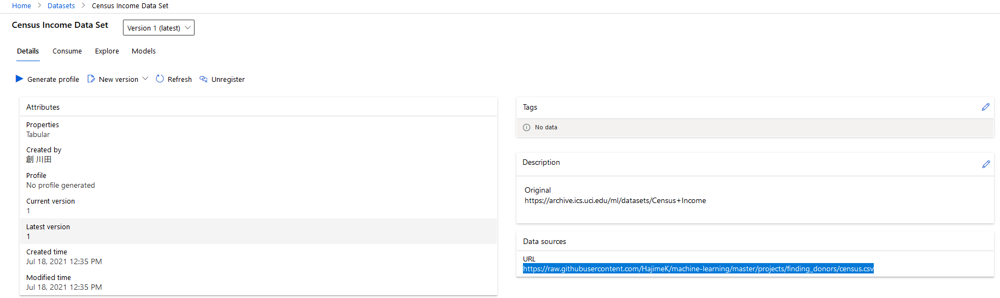

For stable learning, in Hyperdriver learning,
the feature 'capital-gain' and 'capital-loss' are skewed and transformed with log.
More over together with those features,
'age', 'education-num', and  'hours-per-week' range are adjusted to get valued between 0 and 1 to avoid numerical caluculation impacts.

## Automated ML
Following is the`automl` settings and configuration for the experiment

```
automl_settings = {
    "compute_target": cpu_cluster,
    "experiment_timeout_minutes": 30,
    "max_concurrent_iterations": 5,
    "primary_metric" : 'accuracy'
}
automl_config = AutoMLConfig(
    task = 'classification',
    training_data = dataset,
    label_column_name = 'income',
    n_cross_validations = 5,
    **automl_settings)
```

Experiment timeout is set to control the use of resources.
I have set maximum 5 simultaneous concurrent iterations, but only 3 worked.
This is because of the restriction of my contract on Azure. The contract worked as a stopper to be overcharged.

Classification task is performed here as we need to predict into 2 classes with the accuracy as its primary metric.
In this example, maximizing the effectiveness of the efforts to approach to potential donors is prioritized. So the accuracy metrics is selected here.

### Results

The best model was a Voting Ensemble model with an accuracy of 0.8714 (See the transition of the BEST at ITERATION *64*). The ensemble has 6 estimators with pre-fitted soft voting classifier to predict the class label based on the argmax of the sums of the predicted probabilities (**Weight** in the below table).

| Classifier         | Preprocess            |              Weight |
|:-------------------|:----------------------|--------------------:|
| lightgbmclassifier | maxabsscaler          | 0.26666666666666666 |
| xgboostclassifier  | standardscalerwrapper |  0.3333333333333333 |
| xgboostclassifier  | standardscalerwrapper |                 0.2 |
| xgboostclassifier  | sparsenormalizer      | 0.06666666666666667 |
| xgboostclassifier  | sparsenormalizer      | 0.06666666666666667 |
| logisticregression | maxabsscaler          | 0.06666666666666667 |

2 xgboostclassiferes and 1 logisticregression  model is put higher weights than others.

For detailed outputs including parapeter values from the experiment, please see below.

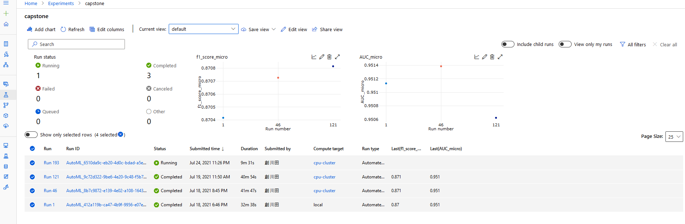

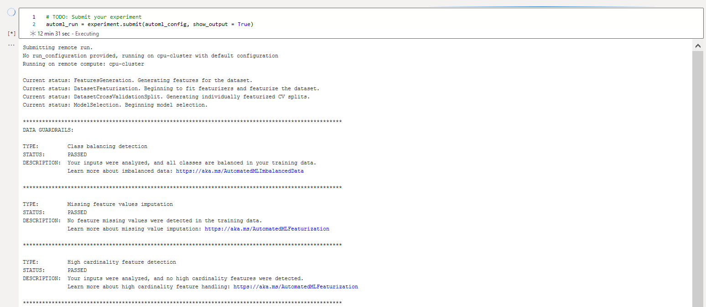
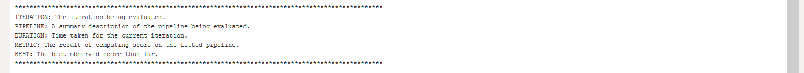

```

 ITERATION   PIPELINE                                       DURATION      METRIC      BEST
         3   MaxAbsScaler RandomForest                      0:00:47       0.7872    0.7872
         0   MaxAbsScaler LightGBM                          0:00:56       0.8698    0.8698
         4   MaxAbsScaler RandomForest                      0:00:46       0.7411    0.8698
         5   MaxAbsScaler RandomForest                      0:00:40       0.7264    0.8698
         2   MaxAbsScaler RandomForest                      0:01:44       0.8337    0.8698
         1   MaxAbsScaler XGBoostClassifier                 0:01:57       0.8617    0.8698
         7   SparseNormalizer XGBoostClassifier             0:01:12       0.8674    0.8698
         8   SparseNormalizer XGBoostClassifier             0:01:03       0.8651    0.8698
        10   SparseNormalizer XGBoostClassifier             0:00:48       0.8578    0.8698
         6   SparseNormalizer XGBoostClassifier             0:02:44       0.8668    0.8698
         9   SparseNormalizer XGBoostClassifier             0:01:13       0.8674    0.8698
        11   StandardScalerWrapper RandomForest             0:00:47       0.8419    0.8698
        12   MaxAbsScaler RandomForest                      0:00:56       0.8156    0.8698
        13   SparseNormalizer XGBoostClassifier             0:00:48       0.8105    0.8698
        15   MaxAbsScaler LightGBM                          0:00:42       0.8317    0.8698
        16   MaxAbsScaler LogisticRegression                0:00:45       0.8470    0.8698
        14   SparseNormalizer XGBoostClassifier             0:01:36       0.8675    0.8698
        18   MaxAbsScaler LightGBM                          0:01:17       0.8333    0.8698
        19   MaxAbsScaler LightGBM                          0:00:43       0.8221    0.8698
        17   MaxAbsScaler ExtremeRandomTrees                0:02:00       0.8148    0.8698
        21   StandardScalerWrapper RandomForest             0:00:53       0.8018    0.8698
        20   SparseNormalizer XGBoostClassifier             0:01:48       0.8678    0.8698
        22   MaxAbsScaler RandomForest                      0:01:15       0.8420    0.8698
        23   MaxAbsScaler LogisticRegression                0:00:50       0.8472    0.8698
        24   MaxAbsScaler LogisticRegression                0:00:49       0.8463    0.8698
        25   MaxAbsScaler LightGBM                          0:00:42       0.7641    0.8698
        26   SparseNormalizer XGBoostClassifier             0:01:03       0.8654    0.8698
        27   StandardScalerWrapper LightGBM                 0:00:43       0.8113    0.8698
        28   MaxAbsScaler LightGBM                          0:00:52       0.8472    0.8698
        29   SparseNormalizer RandomForest                  0:01:32       0.8382    0.8698
        30   SparseNormalizer LightGBM                      0:01:02       0.8585    0.8698
        31   StandardScalerWrapper XGBoostClassifier        0:00:51       0.8529    0.8698
        33   SparseNormalizer LightGBM                      0:00:45       0.8209    0.8698
        32   SparseNormalizer XGBoostClassifier             0:01:09       0.8632    0.8698
        34   SparseNormalizer XGBoostClassifier             0:01:06       0.8631    0.8698
        35   StandardScalerWrapper LightGBM                 0:00:45       0.7522    0.8698
        36   SparseNormalizer XGBoostClassifier             0:01:01       0.8643    0.8698
        37   SparseNormalizer XGBoostClassifier             0:01:04       0.8632    0.8698
        38   StandardScalerWrapper XGBoostClassifier        0:00:49       0.8506    0.8698
        39   SparseNormalizer XGBoostClassifier             0:01:03       0.8629    0.8698
        40   TruncatedSVDWrapper LightGBM                   0:01:03       0.8432    0.8698
        41   SparseNormalizer XGBoostClassifier             0:01:00       0.8598    0.8698
        42   SparseNormalizer XGBoostClassifier             0:01:47       0.8663    0.8698
        43   SparseNormalizer XGBoostClassifier             0:01:34       0.8676    0.8698
        44   StandardScalerWrapper XGBoostClassifier        0:01:20       0.8695    0.8698
        45   MaxAbsScaler LightGBM                          0:01:16       0.8410    0.8698
        46   MaxAbsScaler LogisticRegression                0:01:04       0.8034    0.8698
        47   StandardScalerWrapper LogisticRegression       0:00:51       0.8068    0.8698
        49   MaxAbsScaler LogisticRegression                0:01:00       0.8067    0.8698
        50   SparseNormalizer LightGBM                      0:01:03       0.8614    0.8698
        48   StandardScalerWrapper XGBoostClassifier        0:02:02       0.8697    0.8698
        51   SparseNormalizer XGBoostClassifier             0:01:31       0.8672    0.8698
        52   SparseNormalizer XGBoostClassifier             0:01:20       0.8666    0.8698
        53   SparseNormalizer XGBoostClassifier             0:01:17       0.8658    0.8698
        55   StandardScalerWrapper LightGBM                 0:01:01       0.8562    0.8698
        54   SparseNormalizer XGBoostClassifier             0:01:35       0.8663    0.8698
        57   SparseNormalizer XGBoostClassifier             0:00:56       0.8617    0.8698
        56   SparseNormalizer XGBoostClassifier             0:01:55       0.8680    0.8698
        58   StandardScalerWrapper XGBoostClassifier        0:00:48       0.8656    0.8698
        60   MaxAbsScaler LightGBM                          0:00:41       0.7522    0.8698
        59   SparseNormalizer XGBoostClassifier             0:01:09          nan    0.8698
        64    VotingEnsemble                                0:01:45       0.8714    0.8714
        65    StackEnsemble                                 0:02:00       0.8703    0.8714
```

Screenshots of the `RunDetails` widget and the best model trained (No 64) is provided here.

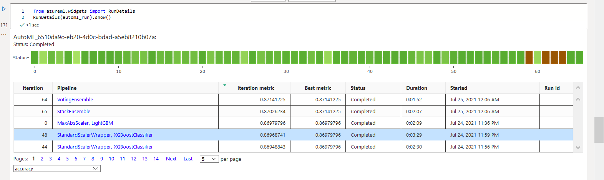
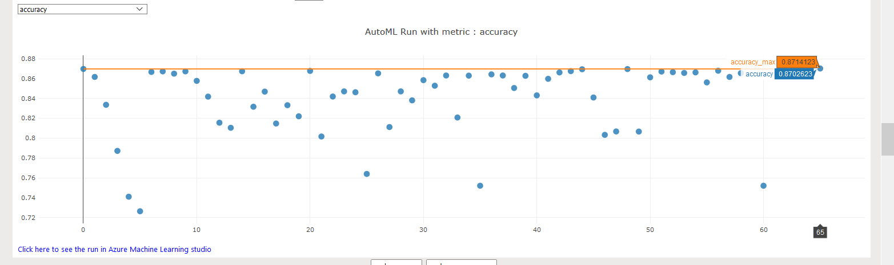
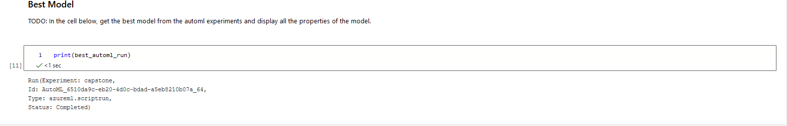

You can find the best run in the Auto ML screenshot above with the Run ID *AutoML_6510da9c-eb20-4d0c-bdad-a5eb8210b07a_64*.

In the portal we can seem the some metrics

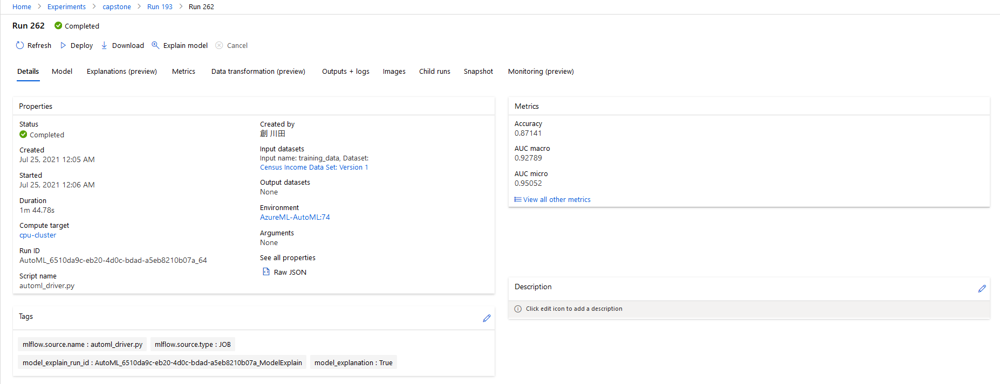
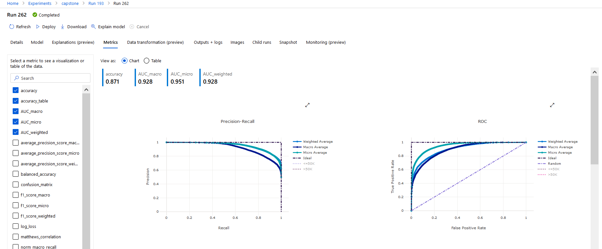

We get the *VotingEnsemble* model as the bet performing model.
This is the model of the following ensemble.

* Detailed Estimator output *

```
datatransformer
{'enable_dnn': False,
 'enable_feature_sweeping': True,
 'feature_sweeping_config': {},
 'feature_sweeping_timeout': 86400,
 'featurization_config': None,
 'force_text_dnn': False,
 'is_cross_validation': True,
 'is_onnx_compatible': False,
 'observer': None,
 'task': 'classification',
 'working_dir': '/mnt/batch/tasks/shared/LS_root/mounts/clusters/vmcapstone/code/Users/smec.kawata/nd00333-capstone/starter_file'}

prefittedsoftvotingclassifier
{'estimators': ['0', '48', '44', '56', '20', '23'],
 'weights': [0.26666666666666666,
             0.3333333333333333,
             0.2,
             0.06666666666666667,
             0.06666666666666667,
             0.06666666666666667]}

0 - maxabsscaler
{'copy': True}

0 - lightgbmclassifier
{'min_data_in_leaf': 20,
 'n_jobs': 1,
 'problem_info': ProblemInfo(
    dataset_samples=45222,
    dataset_features=102,
    dataset_classes=None,
    dataset_num_categorical=0,
    dataset_categoricals=None,
    pipeline_categoricals=None,
    dataset_y_std=None,
    dataset_uid=None,
    subsampling=False,
    task='classification',
    metric=None,
    num_threads=1,
    pipeline_profile='none',
    is_sparse=True,
    runtime_constraints={'mem_in_mb': None, 'wall_time_in_s': None, 'total_wall_time_in_s': 31449600, 'cpu_time_in_s': None, 'num_processes': None, 'grace_period_in_s': None},
    constraint_mode=1,
    cost_mode=1,
    training_percent=100,
    num_recommendations=1,
    model_names_whitelisted=None,
    model_names_blacklisted=None,
    kernel='linear',
    subsampling_treatment='linear',
    subsampling_schedule='hyperband_clip',
    cost_mode_param=None,
    iteration_timeout_mode=0,
    iteration_timeout_param=None,
    feature_column_names=None,
    label_column_name=None,
    weight_column_name=None,
    cv_split_column_names=None,
    enable_streaming=None,
    timeseries_param_dict=None,
    gpu_training_param_dict={'processing_unit_type': 'cpu'}
),
 'random_state': None}

48 - standardscalerwrapper
{'class_name': 'StandardScaler',
 'copy': True,
 'module_name': 'sklearn.preprocessing._data',
 'with_mean': False,
 'with_std': False}

48 - xgboostclassifier
{'base_score': 0.5,
 'booster': 'gbtree',
 'colsample_bylevel': 1,
 'colsample_bynode': 1,
 'colsample_bytree': 0.8,
 'eta': 0.3,
 'gamma': 0,
 'learning_rate': 0.1,
 'max_delta_step': 0,
 'max_depth': 4,
 'max_leaves': 0,
 'min_child_weight': 1,
 'missing': nan,
 'n_estimators': 600,
 'n_jobs': 1,
 'nthread': None,
 'objective': 'reg:logistic',
 'random_state': 0,
 'reg_alpha': 2.1875,
 'reg_lambda': 2.0833333333333335,
 'scale_pos_weight': 1,
 'seed': None,
 'silent': None,
 'subsample': 0.8,
 'tree_method': 'auto',
 'verbose': -10,
 'verbosity': 0}

44 - standardscalerwrapper
{'class_name': 'StandardScaler',
 'copy': True,
 'module_name': 'sklearn.preprocessing._data',
 'with_mean': False,
 'with_std': False}

44 - xgboostclassifier
{'base_score': 0.5,
 'booster': 'gbtree',
 'colsample_bylevel': 1,
 'colsample_bynode': 1,
 'colsample_bytree': 1,
 'eta': 0.1,
 'gamma': 0,
 'learning_rate': 0.1,
 'max_delta_step': 0,
 'max_depth': 9,
 'max_leaves': 0,
 'min_child_weight': 1,
 'missing': nan,
 'n_estimators': 100,
 'n_jobs': 1,
 'nthread': None,
 'objective': 'reg:logistic',
 'random_state': 0,
 'reg_alpha': 1.875,
 'reg_lambda': 0.625,
 'scale_pos_weight': 1,
 'seed': None,
 'silent': None,
 'subsample': 0.7,
 'tree_method': 'auto',
 'verbose': -10,
 'verbosity': 0}

56 - sparsenormalizer
{'copy': True, 'norm': 'l1'}

56 - xgboostclassifier
{'base_score': 0.5,
 'booster': 'gbtree',
 'colsample_bylevel': 1,
 'colsample_bynode': 1,
 'colsample_bytree': 1,
 'eta': 0.1,
 'gamma': 0,
 'learning_rate': 0.1,
 'max_delta_step': 0,
 'max_depth': 3,
 'max_leaves': 0,
 'min_child_weight': 1,
 'missing': nan,
 'n_estimators': 400,
 'n_jobs': 1,
 'nthread': None,
 'objective': 'reg:logistic',
 'random_state': 0,
 'reg_alpha': 0.3125,
 'reg_lambda': 0.9375,
 'scale_pos_weight': 1,
 'seed': None,
 'silent': None,
 'subsample': 0.8,
 'tree_method': 'auto',
 'verbose': -10,
 'verbosity': 0}

20 - sparsenormalizer
{'copy': True, 'norm': 'l2'}

20 - xgboostclassifier
{'base_score': 0.5,
 'booster': 'gbtree',
 'colsample_bylevel': 1,
 'colsample_bynode': 1,
 'colsample_bytree': 0.6,
 'eta': 0.3,
 'gamma': 1,
 'learning_rate': 0.1,
 'max_delta_step': 0,
 'max_depth': 6,
 'max_leaves': 31,
 'min_child_weight': 1,
 'missing': nan,
 'n_estimators': 200,
 'n_jobs': 1,
 'nthread': None,
 'objective': 'reg:logistic',
 'random_state': 0,
 'reg_alpha': 0,
 'reg_lambda': 1.6666666666666667,
 'scale_pos_weight': 1,
 'seed': None,
 'silent': None,
 'subsample': 0.9,
 'tree_method': 'auto',
 'verbose': -10,
 'verbosity': 0}

23 - maxabsscaler
{'copy': True}

23 - logisticregression
{'C': 24.420530945486497,
 'class_weight': None,
 'dual': False,
 'fit_intercept': True,
 'intercept_scaling': 1,
 'l1_ratio': None,
 'max_iter': 100,
 'multi_class': 'ovr',
 'n_jobs': 1,
 'penalty': 'l2',
 'random_state': None,
 'solver': 'saga',
 'tol': 0.0001,
 'verbose': 0,
 'warm_start': False}
```


### Improvements

You can see that AutoML could have obtained better metrics value (accuracy = 0.871) that that of Hyperparameter tuning (accuracy = 0.757).
But still this is not enough.
As a matter of fact, I saw the predictors predics wrongly for the test datasets.
Seeing the actual and predicted, there are some differences observed.

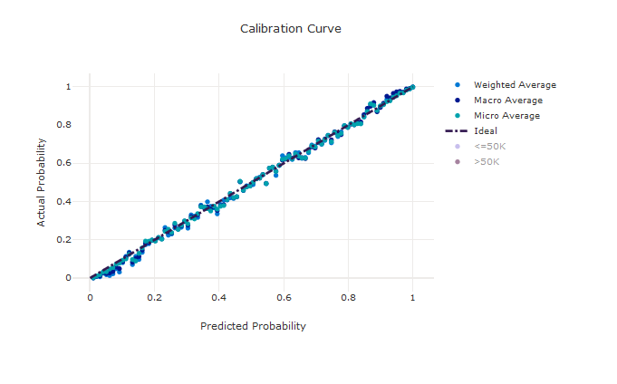

The dataset used here could have outlier data. Properly removing them could results in better predictors.

## Hyperparameter Tuning

RandomForestClassifier is selected here to compare with the AutoML selected models. As seen above AuotoML selects models most out of ensemple models.
So here, I selected one of the ensemble models to compare the manually tuned models with AutoML.

The parameters used for hyperparameter tuning are below that I have experieced with the dataset, better result can be obtained within the range below 
<a href="https://github.com/HajimeK/machine-learning/blob/master/projects/finding_donors/finding_donors.ipynb">link</a> .

- Number of estimators a selected among [10, 30, 50, 70, 90]
- Max tree depth among [5, 7, 9, 10]

### Results

We get the following for the best model with Run ID *HD_414d1634-fa02-4c03-a50d-39f4cff4733c_9*.

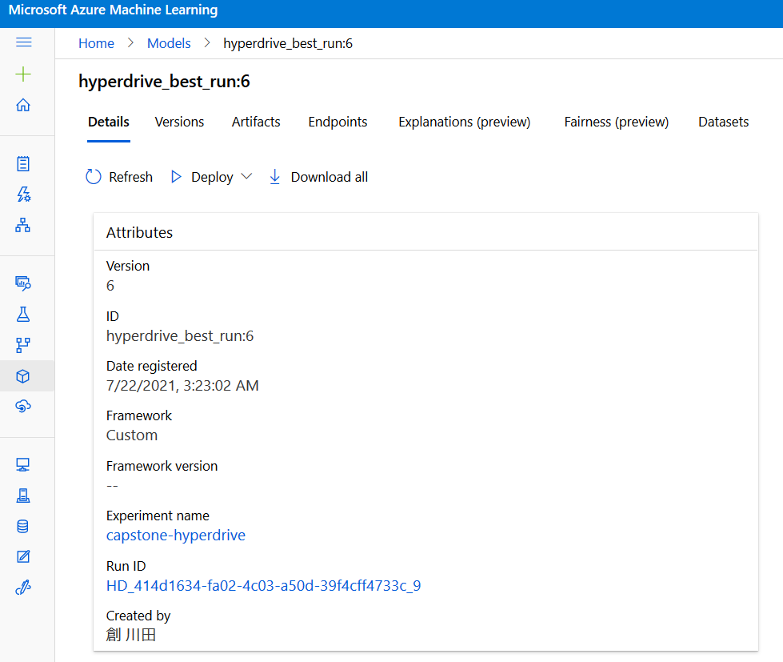

The same can be obtained in the notebook as below.
(Caution: The following comes from an output of another run. But you can get the same for the run in the report.)

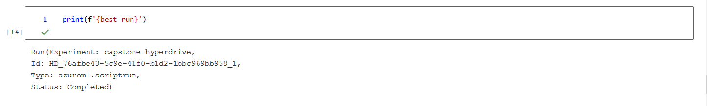


Accuracy 0.757
Max iterations:5
Number of Estimators:90
This is almost idendical to the reuslt I have experienced with my local PC except the Accuracy score.

This might came from the traing and test data selection.
Featre tuning has been done, but could have some outliers in this data.
So removing outliers could improve the performance.

Screenshots of run details in the Jupyter notebook are listed below.
Also the best model output is highlighted by pointing a datapoint corresponds to it.

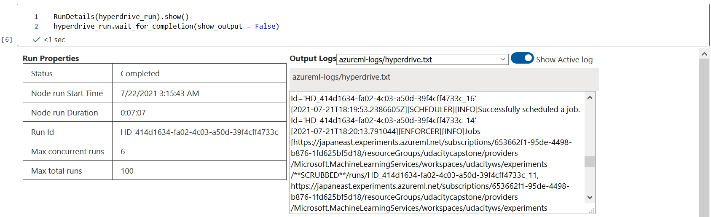
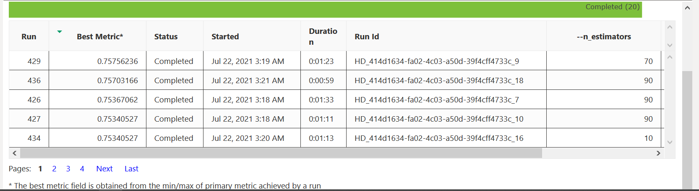
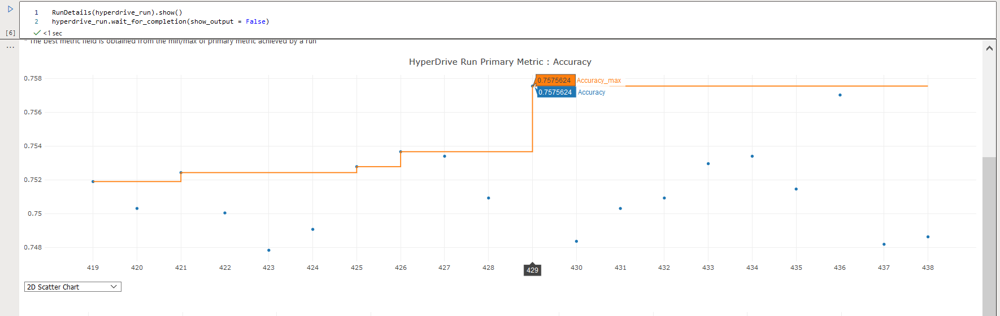
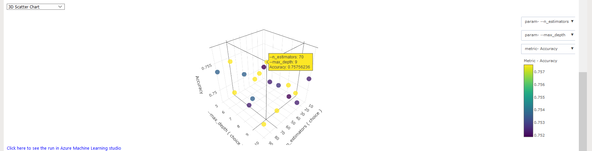
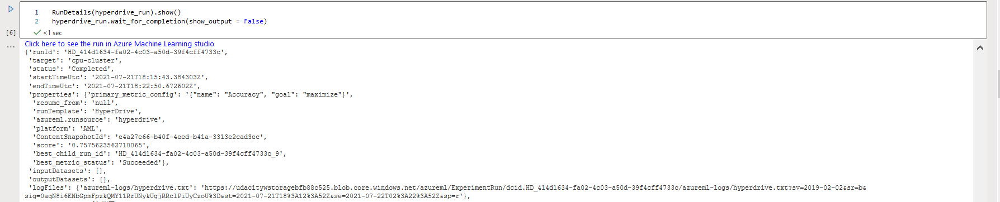
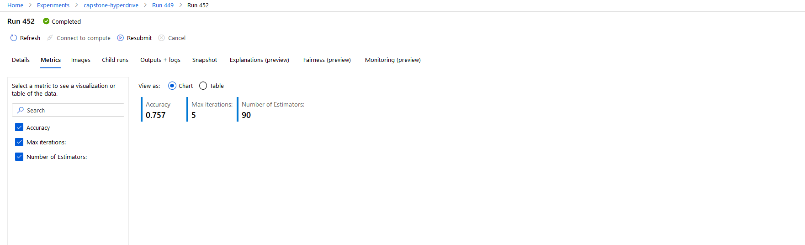


## Model Deployment

The models are deployed using Azure Container Instance (ACI) as a WebService. 
The model is successfully deployed as a web service and a REST endpoint is created.

Acreenshots are provided with REST call examples.
### AutoML

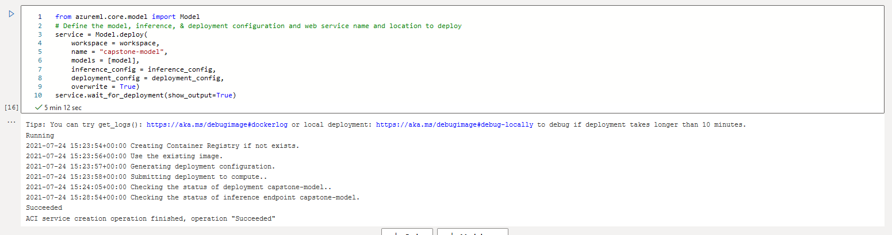

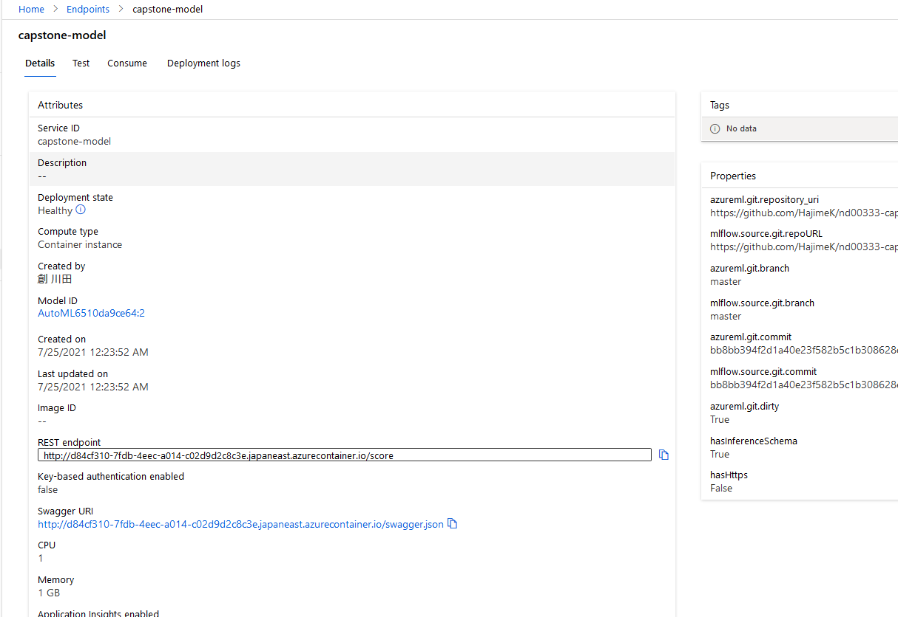

#### REST call example

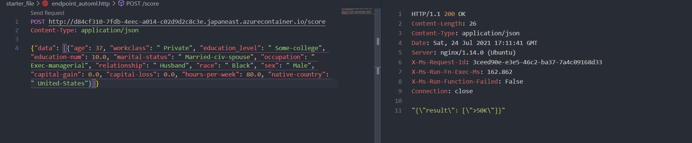

### Hyper Drive

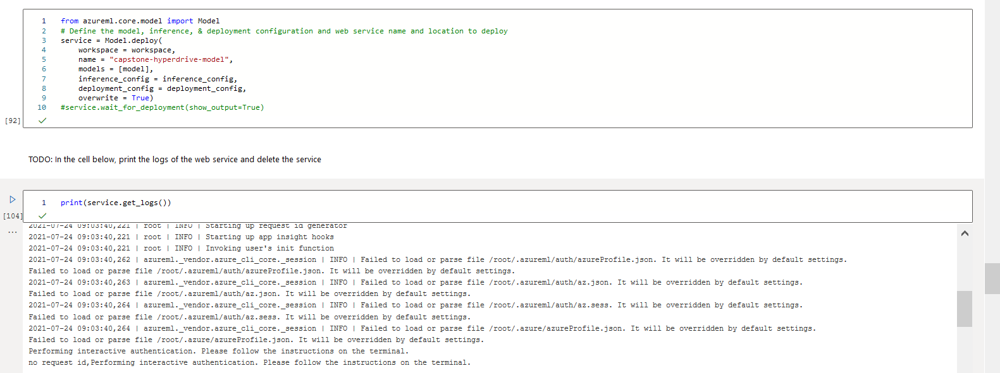

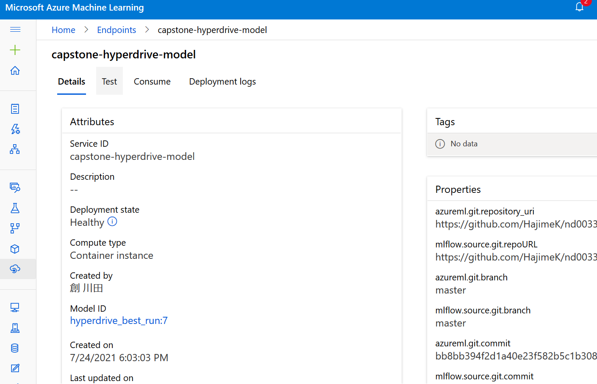

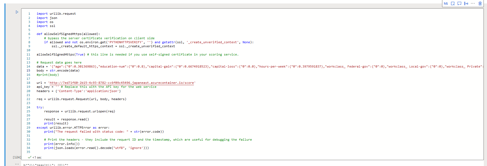

#### REST call example

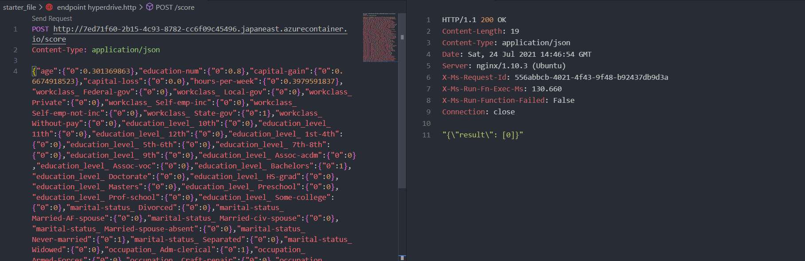


## Screen Recording

### Train AutoML and Hyperdrive models and deploy to each endpoints

https://youtu.be/78i1z5hWWco

### Consume endpoints with VSCode REST plug-in

https://youtu.be/ElMeRdiwnqU


## Future Improvement

As stated some feature engineering attempted for hyperparameter tuning case.
But it performs worse than the Auto ML.

Dataset might contain outliers for stable classifiyer. 
- **Removing outliers**
As stated some feature engineering attempted for hyperparameter tuning case.
But it performs worse than the Auto ML. Ensemble model with different types of classifier worked.
Auto ML is also not perfoming, the metrics value (accuracy) is less than 0.9.
Seeing in the data processing, it is just converting data. Maybe further analysis on the outliers, PCA might contribute to more accurate and faster learnings.

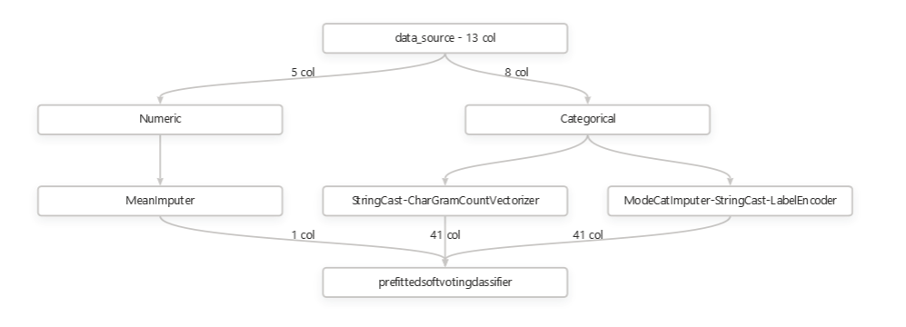


- **Other metrics other than Accuracy should be tried**
Auto ML is also not perfoming, the metrics value (accuracy) is less than 0.9.

- **Enable Deep Learning**
This case only shallow learning classifieres are selected. Enabling deep learining could imrove model performance by solving the potential unlinearlity feature in the dataset.

- **Improving response time**
The response time when calling from the client is around 150 msec. Considering to embed this model in the Web Application process, which includes visualization, data processing, page loading, and etc, model is better be deployed to the site close to the Web Application running in the networkd. Might better use ONNX model or utilize microservice deployment to achieve flexibility for deployjment.
